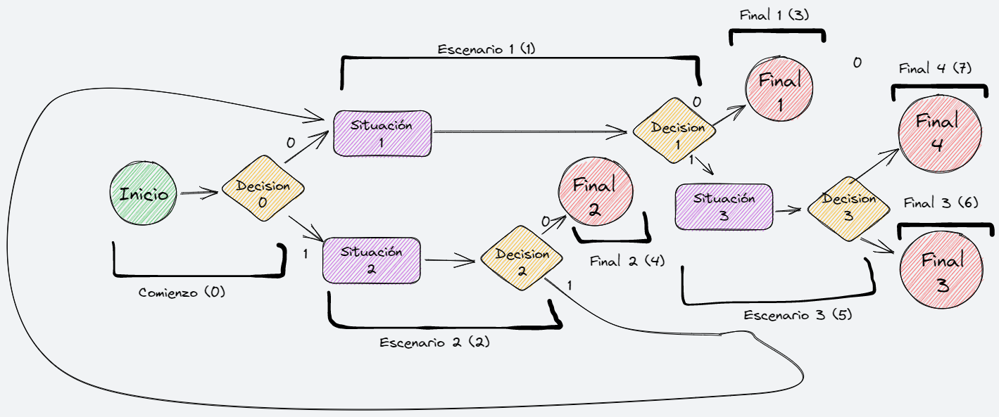

# Console Adventure

## Author: Juan Santos Poyato

## About this project

Little console script that tells a story based on user choices.
Design folder contains the design of the mini-game, a drawn map of choices that you shows iterations. Map:

The story text is inserted into the code from 3 different texts files in text dir. The way the files struct the story is explicitly indicated in the map.

## How to execute

Using the command console, assuming you have installed GCC for your operating system (check how to if you don't) and your working directory is in this folder (cd path/consoleAdventure), type after the prompt (note "prompt>" is the prompt with the path of the active working directory of the command console):

> prompt> gcc consoleAdventure.c

This will create an executable named "a". Now just type on the console:

> prompt>a

And enjoy the adventure!
